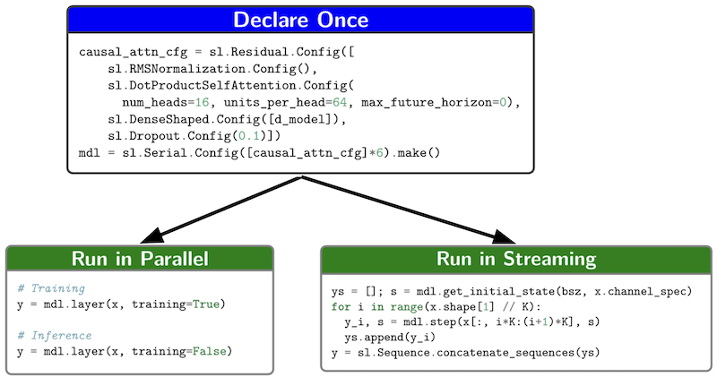

# Sequence Layers

A neural network API and library (in Jax, MLX, and TensorFlow 2) for easy
creation of sequence models that can be executed both layer-by-layer (e.g.
teacher forced training) and step-by-step (e.g. autoregressive sampling). It
mitigates many common bugs arising in both streaming and parallel sequence
processing around padding, resampling, and causality while giving a composable,
declarative syntax.

You can read more about the design and features of SequenceLayers in our
[technical report](https://arxiv.org/abs/2507.23292), or quickly get started
with our intro notebook:

[](https://colab.research.google.com/github/google/sequence-layers/blob/main/notebooks/intro.ipynb)

**Note:** Only Jax support is installed by default. Use
`pip install sequence_layers[mlx]` for MLX and
`pip install sequence_layers[tensorflow]` for TensorFlow.

**We welcome contributions!** To do this, clone the repo and install developer
dependencies via `pip install -e .[dev]` (or `.[dev,tensorflow]`, etc.) to allow
running tests, e.g., `pytest -n auto sequence_layers/jax` to do so over multiple
workers. See the [contributing guide](CONTRIBUTING.md).

**Disclaimer:** This is not an officially supported Google product.

## Streamable networks, out of the box



A key feature of the library is that layers support streaming (step-by-step)
operation. To achieve this, every layer has a notion of state when and a `step`
function in addition to the typical layer-wise processing feature found in other
libraries like Keras. When layers support a `step` method, their `layer` method
produces identical results for the same sequence of input blocks enabling easy
switching between step-wise and layer-wise processing depending on the use case.

## Goals

Increased development velocity for both research and production applications of
sequence modeling.

*   Support for layer-by-layer and step-by-step processing in a single
    implementation.
*   Declarative API.
*   Composable, thin abstractions.
*   Easy mix-and-match of popular sequence modeling paradigms (convolutional,
    recurrent, attention architectures).
*   A quick path to deployment with tf.lite support for every layer.
*   Tracking of invalid timesteps (those computed from padding).

## Citation

If you found this library or its design concepts useful, we'd greatly appreciate
a citation of our technical report:

```
@article{skerryryan2025sequencelayers,
  author       = {RJ Skerry-Ryan and Julian Salazar and Soroosh Mariooryad and David Kao and Daisy Stanton and Eric Battenberg and Matt Shannon and Ron J. Weiss and Robin Scheibler and Jonas Rothfuss and Tom Bagby},
  title        = {{S}equence{L}ayers: {S}equence Processing and Streaming Neural Networks Made Easy},
  journal      = {CoRR},
  volume       = {abs/2507.23292},
  year         = {2025}
}
```
